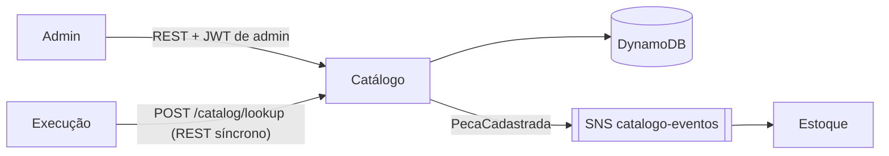

# oficina-mecanica-catalogo

Microsserviço de **Catálogo** do sistema da oficina mecânica (Tech Challenge FIAP, Fase 4): mantém os **serviços oferecidos** (preço e tempo estimado) e as **fichas de peças** (SKU, preço e atributos específicos de cada tipo de peça).

É um dos 5 microsserviços do sistema. A divisão, a saga e o contrato entre os serviços estão documentados no repositório principal, [oficina-mecanica-fiap](https://github.com/phantosmia/oficina-mecanica-fiap):

- [RFC-0006: decomposição em microsserviços](https://github.com/phantosmia/oficina-mecanica-fiap/blob/main/docs/rfcs/0006-decomposicao-em-microsservicos.md)
- [ADR-0009: persistência poliglota (por que DynamoDB aqui)](https://github.com/phantosmia/oficina-mecanica-fiap/blob/main/docs/adrs/0009-persistencia-poliglota-por-servico.md)
- [`docs/saga.md`: contrato de mensagens entre os serviços](https://github.com/phantosmia/oficina-mecanica-fiap/blob/main/docs/saga.md)

## Papel no sistema



- **Fora da saga.** O Catálogo não tem efeito colateral sobre a OS: quando o mecânico conclui um diagnóstico, a Execução consulta aqui, por REST síncrono, os serviços e peças escolhidos, para validá-los e copiar os preços. Como é só leitura, não há o que compensar.
- **Publica `PecaCadastrada`.** O Estoque assina esse evento e cria o saldo zerado de cada peça nova. O Estoque nunca lê o banco do Catálogo.

## Arquitetura do serviço

Clean Architecture por contexto, a mesma organização do OS Service:

```
app/
├── service_catalog/   # serviços oferecidos: domain / application / adapters / controller / schemas
├── parts/             # fichas de peças (+ evento PartRegistered → "PecaCadastrada")
├── lookup/            # consulta em lote usada pela Execução
├── system/            # /health e /ready
├── shared/            # settings, JWT, DynamoDB, envelope de mensagens, outbox, publicador SNS, logs
└── outbox_relay.py    # processo que publica a outbox no SNS
```

Regra de dependência: `controller → application → domain` e `adapters → domain`. O domínio não importa nada de FastAPI, boto3 ou Pydantic.

### DynamoDB (*single-table design*)

Uma tabela só, `oficina-catalogo`, com chave `pk` e um índice secundário `gsi1` (`gsi1pk`, `gsi1sk`):

| Item | `pk` | `gsi1pk` / `gsi1sk` | Para quê |
|---|---|---|---|
| Serviço | `SERVICE#<id>` | `SERVICE` / `<nome>#<id>` | Listagem ordenada por nome |
| Peça | `PART#<id>` | `PART` / `<nome>#<id>` | Listagem ordenada por nome |
| Unicidade de SKU | `SKU#<sku>` | — | O DynamoDB não tem `UNIQUE`: este item é gravado na mesma transação da peça, com a condição de ainda não existir |
| Outbox | `OUTBOX#<message_id>` | `OUTBOX` / `<data>#<id>` | Eventos pendentes de publicação, em ordem |

Uma tabela só é o que permite gravar a peça, o item de unicidade do SKU e o evento numa única `TransactWriteItems`.

### Outbox e publicação de eventos

O evento `PecaCadastrada` não é publicado durante a requisição: ele é gravado como item da outbox **na mesma transação** que cadastra a peça. Um processo separado (`python -m app.outbox_relay`, Deployment próprio com 1 réplica) publica os pendentes no SNS e os apaga. A entrega é *at-least-once*: os consumidores descartam repetições pelo `message_id`.

Os cabeçalhos de *distributed tracing* do New Relic são capturados no momento da gravação e enviados como `MessageAttributes`, então o trace não se parte entre a requisição HTTP e a publicação.

### Decisões de comportamento

- **Leitura pública, escrita só com admin.** `GET` e `POST /catalog/lookup` não exigem login: o catálogo é a tabela de preços da oficina, e a Execução consulta sem token. Criar, alterar e desativar exigem o JWT de admin emitido pelo OS Service (`POST /auth/token` em oficina-mecanica-fiap), validado aqui com o mesmo segredo.
- **Excluir é desativar.** Sem chave estrangeira entre microsserviços, apagar um item quebraria OS e orçamentos antigos que guardam o ID dele. `DELETE` marca `active=false`: o item some da listagem (exceto com `?include_inactive=true`) e o lookup o devolve com `active=false`, para quem chama recusar.
- **IDs são UUID.** Os dados de exemplo usam UUID v5 derivados do SKU/nome (`scripts/seed.py`), para o Estoque conseguir semear o saldo das mesmas peças sem consultar o Catálogo.

## API

Swagger em `http://localhost:8001/docs` (docker-compose) ou `/docs` do Service no cluster.

| Método | Rota | Auth | Descrição |
|---|---|---|---|
| `GET` | `/services` | — | Serviços ativos, por nome (`?include_inactive=true` inclui os desativados) |
| `GET` | `/services/{id}` | — | Um serviço |
| `POST` | `/services` | admin | Cadastra um serviço |
| `PUT` | `/services/{id}` | admin | Altera campos de um serviço |
| `DELETE` | `/services/{id}` | admin | Desativa um serviço |
| `GET` | `/parts` | — | Peças ativas, por nome (`?include_inactive=true` inclui as desativadas) |
| `GET` | `/parts/{id}` | — | Uma peça |
| `POST` | `/parts` | admin | Cadastra uma peça e emite `PecaCadastrada` (409 se o SKU já existir) |
| `PUT` | `/parts/{id}` | admin | Altera campos de uma peça (409 se o novo SKU já existir) |
| `DELETE` | `/parts/{id}` | admin | Desativa uma peça |
| `POST` | `/catalog/lookup` | — | Consulta em lote (até 100 IDs de cada tipo): itens encontrados, com preço e `active`, e IDs inexistentes |
| `GET` | `/health` | — | *Liveness* |
| `GET` | `/ready` | — | *Readiness*: confere acesso à tabela DynamoDB |

Exemplo de peça com atributos específicos do tipo:

```json
{
  "name": "Óleo sintético 5W30",
  "sku": "OLEO-5W30-1L",
  "unit_price": 45.0,
  "attributes": { "viscosidade": "5W30", "volume_litros": 1 }
}
```

## Como rodar

### Docker Compose (API + relay + LocalStack)

```bash
docker compose up --build
```

- API em `http://localhost:8001` (Swagger em `/docs`), já com os dados de exemplo.
- O LocalStack (porta 4566) emula DynamoDB e SNS; a tabela e o tópico são criados na subida (`scripts/bootstrap_local.py`).

Para gerar um token de admin sem subir o OS Service:

```bash
poetry run python -c "from jose import jwt; import time; print(jwt.encode({'sub': 'admin', 'exp': time.time() + 3600}, 'change-me-in-production', algorithm='HS256'))"
```

### Testes

```bash
poetry install
poetry run pytest
```

Os testes usam o [moto](https://github.com/getmoto/moto), que simula DynamoDB, SNS e SQS em memória: não precisam de Docker nem de AWS. A cobertura mínima exigida é 80% (`pyproject.toml`).

## Configuração

| Variável | Padrão | Descrição |
|---|---|---|
| `CATALOG_TABLE_NAME` | `oficina-catalogo` | Tabela DynamoDB |
| `CATALOG_EVENTS_TOPIC_ARN` | — | Tópico SNS de eventos do Catálogo (usado pelo relay) |
| `AWS_REGION` | `us-east-1` | Região AWS |
| `AWS_ENDPOINT_URL` | — | Só local: endpoint do LocalStack |
| `JWT_SECRET_KEY` | `change-me-in-production` | Mesmo segredo do OS Service |
| `ADMIN_USERNAME` | `admin` | `sub` esperado no JWT de admin |
| `OUTBOX_POLL_INTERVAL_SECONDS` | `2` | Intervalo do relay quando a outbox está vazia |
| `NEW_RELIC_LICENSE_KEY` | — | Ativa o agente APM do New Relic |
| `BOOTSTRAP_LOCAL_RESOURCES` / `SEED_ON_START` | `false` | Só local: cria tabela/tópico e carrega dados de exemplo na subida |
